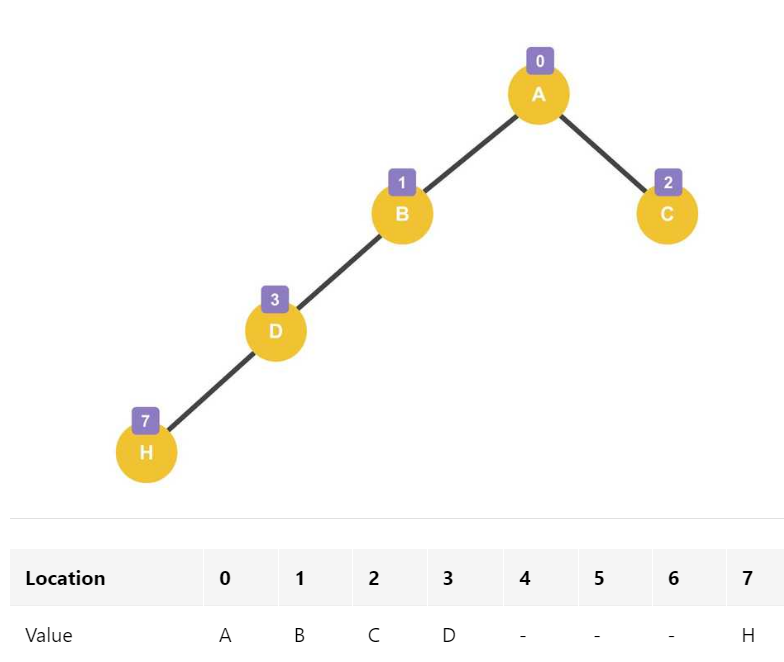

## 자료구조 & 알고리즘

📚 공부한 자료

- 파이썬 알고리즘 인터뷰

### **1. 시간복잡도와 공간복잡도에 대해 설명해 주세요.**

- **Big-O, Big-Theta, Big-Omega 에 대해 설명해 주세요.**
- **다른 것을 사용하지 않고, Big-O를 사용하는 이유가 있을까요?**
- **O(1)은 O(N^2) 보다 무조건적으로 빠른가요?**

### **2. 링크드 리스트에 대해 설명해 주세요.**

- **일반 배열과, 링크드 리스트를 비교해 주세요.**

배열은 특정 크기만큼 연속된 메모리 공간에 데이터를 저장하는 자료구조입니다. 연속된 공간에 데이터가 나열되어 있기 때문에 랜덤으로 접근하는 것이 가능합니다. 첫 번째 데이터가 저장된 주소 공간을 기준으로 원하는 위치로 점프하면 되기 때문입니다. 하지만, 데이터의 빈번한 추가나 삭제는 효율적이지 않습니다. 데이터를 앞이나 중간에 추가하는 경우는 데이터를 하나씩 밀어야 하기 때문에 그만큼의 리소스가 들어가고, 뒤로 추가하는 경우에도 얼마만큼의 데이터가 추가되어야 하는지 잘 판단하고 공간을 만들어야 합니다.

링크드 리스트는 연속된 메모리 공간에 저장되어 있지 않고 데이터가 메모리 공간 상에 고유한 노드로 존재합니다. 이 노드에 앞과 뒤에 있는 데이터가 저장된  공간의 주소가 저장됩니다. 데이터를 추가하기 위해서는 데이터를 추가하고 바로 앞 뒤에 저장된 데이터의 주소만 연결하면 되기 때문에 배열보다 효율적입니다. 하지만, 배열과는 달리 연속된 공간에 저장된 게 아니기 때문에 중간에 있는 데이터를 찾기 위해서는 앞에서부터 순차적으로 찾아야 합니다.

- **링크드 리스트를 사용해서 구현할 수 있는 다른 자료구조에 대해 설명해 주세요.**

&nbsp;일반적으로 링스트 리스트라고 하면 single linked list입니다. 링크드 리스트는 노드라는 객체로 구성되는데 노드에는 데이터와 다음 노드의 위치 정보(포인터)가 저장됩니다. 그렇기 때문에 중간에 노드가 추가될 때 앞 뒤 데이터가 저장된 메모리의 주소만 저장하면 되기 때문에 데이터의 삽입과 삭제가 용이합니다.

원형 연결 리스트: 단순 연결 리스트는 임의의 노드에서 이전에 위치한 노드에 접근할 수 없기 때문에 헤드 포인터부터 순회해야 합니다. 이런 문제를 해결하기 위해 마지막 노드의 포인터 영역을 첫 번째 노드를 가리키도록 만든 자료구조입니다.

이중 연결 리스트

스택

큐

해시 테이블

스킵 리스트

### **3. 스택과 큐에 대해서 설명해 주세요.**

- **스택 2개로 큐를, 큐 2개로 스택을 만드는 방법과, 그 시간복잡도에 대해 설명해 주세요.**
- **시간복잡도를 유지하면서, 배열로 스택과 큐를 구현할 수 있을까요?**
- **Prefix, Infix, Postfix 에 대해 설명하고, 이를 스택을 활용해서 계산/하는 방법에 대해 설명해 주세요.**
- **Deque는 어떻게 구현할 수 있을까요?**
- **(C++ 한정) Deque의 Random Access 시간복잡도는 O(1) 입니다. 이게 어떻게 가능한걸까요?**

### **4. 해시 자료구조에 대해 설명해 주세요.**

- **값이 주어졌을 때, 어떻게 하면 충돌이 최대한 적은 해시 함수를 설계할 수 있을까요?**
- **해시값이 충돌했을 때, 어떤 방식으로 처리할 수 있을까요?**
- **본인이 사용하는 언어에서는, 어떤 방식으로 해시 충돌을 처리하나요?**
- **Double Hashing 의 장점과 단점에 대해서 설명하고, 단점을 어떻게 해결할 수 있을지 설명해 주세요.**
- **Load Factor에 대해 설명해 주세요. 본인이 사용하는 언어에서의 해시 자료구조는 Load Factor에 관련한 정책이 어떻게 구성되어 있나요?**
- **다른 자료구조와 비교하여, 해시 테이블은 멀티스레드 환경에서 심각한 수준의 Race Condition 문제에 빠질 위험이 있습니다. 성능 감소를 최소화 한 채로 해당 문제를 해결할 수 있는 방법을 설계해 보세요.**

### **5. 트리와 이진트리, 이진탐색트리에 대해 설명해 주세요.**

- **그래프와 트리의 차이가 무엇인가요?**
- **이진탐색트리에서 중위 탐색을 하게 되면, 그 결과는 어떤 의미를 가지나요?**
- **이진탐색트리의 주요 연산에 대한 시간복잡도를 설명하고, 왜 그런 시간복잡도가 도출되는지 설명해 주세요.**
- **이진탐색트리의 한계점에 대해 설명해주세요.**
- **이진탐색트리의 값 삽입, 삭제 방법에 대해 설명하고, 어떤식으로 값을 삽입하면 편향이 발생할까요?**
- **이진탐색트리와 동일한 로직을 사용하면, 삼진탐색트리도 정의할 수 있을까요? 안 된다면, 그 이유에 대해 설명해 주세요.**

### **6. 힙에 대해 설명해 주세요.**

&nbsp;힙은 정렬, 우선순위 큐, 스케줄링과 같은 다양한 알고리즘에서 활용되는 자료구조입니다. 힙은 완전 이진 트리의 일종으로 부모 노드와 자식 노드 간에 특정한 조건을 만족합니다.
※완전 이진 트리: 마지막 레벨을 제외한 모든 레벨에 노드가 완전히 채워져 있는 트리 구조

- **힙을 배열로 구현한다고 가정하면, 어떻게 값을 저장할 수 있을까요?**

루트 노드의 인덱스를 1이라고 가정하고 왼쪽 자식 노드는 부모 노드에 2를 곱하고 오른쪽 자식 노드는 2를 곱한 후 1을 더해줍니다. 부모 노드를 첫 번째 원소로 하여 왼쪽 자식 노드부터 채우는 방식으로 값을 저장합니다.

- **힙의 삽입, 삭제 방식에 대해 설명하고, 왜 이진탐색트리와 달리 편향이 발생하지 않는지 설명해 주세요.**

힙은 완전 이진 트리이기 때문에 노드를 삽입할 때 왼쪽부터 삽입해야 하므로 편향이 발생하지 않습니다. 힙은 보통 배열로 구현합니다. 배열로 구현한 트리가 편향되면 메모리의 낭비가 발생하게 됩니다. 예를 들어, 완전 이진 트리는 자식 노드를 모두 갖기 때문에 모든 노드의 값들이 배열에 들어가지만 일반 트리에 자식 노드가 없는 경우 배열에 값이 없는 경우가 있을 수 있습니다.

출처: https://evan-moon.github.io/2019/10/12/introduction-data-structure-heap/

힙의 삽입: 기본적으로 왼쪽 최하단부 노드부터 채워지며, 만약 삽입된 노드가 부모 노드와 비교해서 작으면 그 자리에 위치합니다. 만약 부모 노드보다 값이 크면 부모 노드와 위치를 바꾸면서 최종적으로 루트 노드와 비교하게 됩니다.

힙의 삭제: 최대 힙에서의 최대값은 루트 노드이므로 루트노드가 삭제됩니다. 이때, 루트노드가 비게 되는데 마지막 노드를 가져와서 대체합니다. 이 경우에도, 자식-부모 노드 간에 값을 비교하여 위치가 바뀝니다.

※힙 자료구조의 목표는 바로 최대값이나 최소값을 알아내는 것이기 때문에 내부적으로 부모 노드와 값을 비교해서 데이터가 바뀝니다(형제 노드와는 비교 x).

- **힙 정렬의 시간복잡도는 어떻게 되나요? Stable 한가요?**

트리도 노드를 사용하기에 부모와 자식 노드의 위치가 포인터로 연결되어 있습니다. 따라서, 삭제와 삽입 연산 자체는 O(1)이지만 최소힙과 최대힙 조건이 깨져 위치가 바뀌는 과정이 필요하므로 최종적으로 O(log n)의 시간 복잡도를 가지게 됩니다.
※레벨(노드의 깊이)이 높아질수록 데이터의 수는 최대 2배씩 커집니다.

정렬이란 과정을 거쳐 노드의 순서가 바뀌기 때문에 unstable 합니다.

출처: https://yozm.wishket.com/magazine/detail/2312/

https://velog.io/@gnwjd309/data-structure-heap

https://gmlwjd9405.github.io/2018/05/10/data-structure-heap.html

https://hojunking.tistory.com/64

https://chunsubyeong.tistory.com/88
 
https://jooyoung1121.github.io/cs/data%20structure/sort/

### **7. BBST (Balanced Binary Search Tree) 와, 그 종류에 대해 설명해 주세요.**

- **Red Black Tree는 어떻게 균형을 유지할 수 있을까요?**
- **Red Black Tree의 주요 성질 4가지에 대해 설명해 주세요.**
- **2-3-4 Tree, AVL Tree 등의 다른 BBST 가 있음에도, 왜 Red Black Tree가 많이 사용될까요?**

### **8. 정렬 알고리즘에 대해 설명해 주세요.**

- **Quick Sort와 Merge Sort를 비교해 주세요.**
- **Quick Sort에서 O(N^2)이 걸리는 예시를 들고, 이를 개선할 수 있는 방법에 대해 설명해 주세요.**
- **Stable Sort가 무엇이고, 어떤 정렬 알고리즘이 Stable 한지 설명해 주세요.**
- **Merge Sort를 재귀를 사용하지 않고 구현할 수 있을까요?**
- **Radix Sort에 대해 설명해 주세요.**
- **Bubble, Selection, Insertion Sort의 속도를 비교해 주세요.**
- **값이 거의 정렬되어 있거나, 아예 정렬되어 있다면, 위 세 알고리즘의 성능 비교 결과는 달라질까요?**
- **본인이 사용하고 있는 언어에선, 어떤 정렬 알고리즘을 사용하여 정렬 함수를 제공하고 있을까요?**
- **정렬해야 하는 데이터는 50G 인데, 메모리가 4G라면, 어떤 방식으로 정렬을 진행할 수 있을까요?**

### **9. 그래프 자료구조에 대해 설명하고, 이를 구현할 수 있는 두 방법에 대해 설명해 주세요.**

- **각 방법에 대해, "두 정점이 연결되었는지" 확인하는 시간복잡도와 "한 정점에 연결된 모든 정점을 찾는" 시간복잡도, 그리고 공간복잡도를 비교해 주세요.**
- **정점의 개수가 N개, 간선의 개수가 N^3 개라면, 어떤 방식으로 구현하는 것이 효율적일까요?**
- **사이클이 없는 그래프는 모두 트리인가요? 그렇지 않다면, 예시를 들어주세요.**

### **10. 그래프에서, 최단거리를 구하는 방법에 대해 설명해 주세요.**

- **트리에서는 어떤 방식으로 최단거리를 구할 수 있을까요? (위 방법을 사용하지 않고)**
- **다익스트라 알고리즘에서, 힙을 사용하지 않고 구현한다면 시간복잡도가 어떻게 변화할까요?**
- **정점의 개수가 N개, 간선의 개수가 N^3 개라면, 어떤 알고리즘이 효율적일까요?**
- **A\* 알고리즘에 대해 설명해 주세요. 이 알고리즘은 다익스트라와 비교해서 어떤 성능을 낼까요?**
- **음수 간선이 있을 때와, 음수 사이클이 있을 때 각각 어떤 최단거리 알고리즘을 사용해야 하는지 설명해 주세요.**

### **11. 재귀함수에 대해 설명해 주세요.**

- **재귀 함수의 동작 과정을 Call Stack을 활용해서 설명해 주세요.**
- **언어의 스펙에 따라, 재귀함수의 최적화를 진행해주는 경우가 있습니다. 어떤 경우에 재귀함수의 최적화가 가능하며, 이를 어떻게 최적화 할 수 있을지 설명해 주세요.**

### **12. MST가 무엇이고, 어떻게 구할 수 있을지 설명해 주세요.**

- **Kruskal 알고리즘에서 사용하는 Union-Find 자료구조에 대해 설명해 주세요.**
- **Kruskal 과 Prim 중, 어떤 것이 더 빠를까요?**
- **Kruskal 과 Prim 알고리즘을 통해 얻어진 결과물은 무조건 트리인가요? 만약 그렇다면 증명해 주세요. 그렇지 않다면, 반례를 설명해 주세요.**

### **13. Thread Safe 한 자료구조가 있을까요? 없다면, 어떻게 Thread Safe 하게 구성할 수 있을까요?**

- **배열의 길이를 알고 있다면, 조금 더 빠른 Thread Safe 한 연산을 만들 순 없을까요?**
- **사용하고 있는 언어의 자료구조는 Thread Safe 한가요? 그렇지 않다면, Thread Safe 한 Wrapped Data Structure 를 제공하고 있나요?**

### **14. 문자열을 저장하고, 처리하는 주요 자료구조 및 알고리즘 (Trie, KMP, Rabin Karp 등) 에 대해 설명해 주세요.**

### **15. 이진탐색이 무엇인지 설명하고, 시간복잡도를 증명해 보세요.**

- **Lower Bound, Upper Bound 는 무엇이고, 이를 어떻게 구현할 수 있을까요?**
- **이진탐색의 논리를 적용하여 삼진탐색을 작성한다고 가정한다면, 시간복잡도는 어떻게 변화할까요? (실제 존재하는 삼진탐색 알고리즘은 무시하세요!)**
- **기존 이진탐색 로직에서 부등호의 범위가 바뀐다면, (ex. <= 라면 <로, <이라면 <= 로) 결과가 달라질까요?**

### **16. 그리디 알고리즘과 동적 계획법을 비교해 주세요.**

동적 계획법: 복잡한 문제를 더 작은 하위 문제로 나누어 해결하는 알고리즘 설계 기법입니다. 엄밀히 말하면 알고리즘이라기 보다는 문제 해결 패러다임에 가깝습니다. 쉽게 말해 작은 하위 문제의 답은 저장해놓고 필요할 때 가져와서 사용합니다.
※캐싱을 하기 때문에 중복 계산을 방지하고 계산 속도가 향상됩니다.

그리디 알고리즘: 선택의 순간마다 당장 눈앞에 보이는 최적의 상황만을 쫒아 최종적인 해달에 도달하는 알고리즘 설계 기법입니다. 그것이 지역적으로 봤을 때는 최적일 수 있지만 전역적으로는 최적의 해가 되는지를 보장할 수 없습니다. 예를 들면 1-1-1-100과 1-1-10-10 중 모든 값의 합이 더 작은 것을 찾을 때 그리디 알고리즘은 1-1-1-100이 라는 값이 제일 작다고 판단하지만 실제로는 1-1-10-10이 더 작습니다.

- **그렇다면, 어떤 경우에 각각의 기법을 사용할 수 있을까요?**

동적 계획법: 피보나치 수열과 같이 큰 문제를 작은 하위의 문제로 나눌 수 있는 경우에 사용할 수 있습니다.

그리디 알고리즘: 부분의 최적해들의 집합이 전체 문제의 해답이 될 때 사용할 수 있습니다. 

- **그렇다면, 동적 계획법으로 풀 수 있는 모든 문제는 재귀로 변환하여 풀 수 있나요?**

&nbsp;재귀 함수와 동적 계획법은 구조적으로 비슷합니다. 둘 다 복잡한 문제를 풀기 위해 하위 문제를 찾아 하위 문제부터 풀어나가는 방식입니다. 둘은 계산의 효율성을 위해 이전에 구한 값을 저장하는지 하지 않는지의 차이가 있습니다.

출처: https://namu.wiki/w/%EB%8F%99%EC%A0%81%20%EA%B3%84%ED%9A%8D%EB%B2%95

https://80000coding.oopy.io/60c3d4d3-f569-4b47-bdde-9a65d30f3bc5
