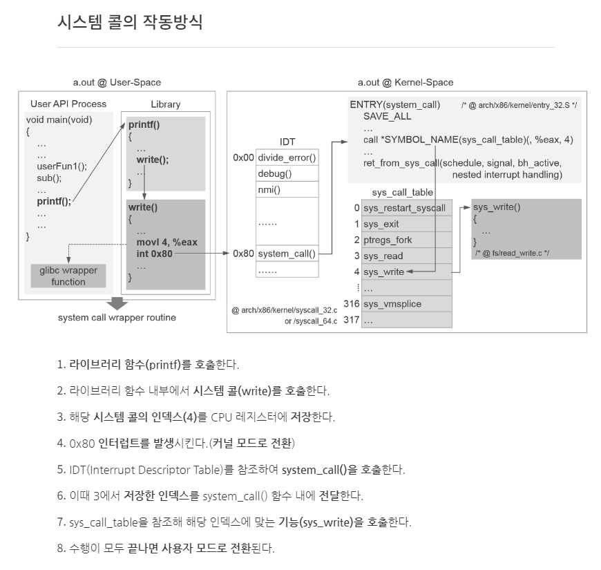

### Operating System

<details>
<summary>📚 공부한 자료</summary>

- 혼자 공부하는 컴퓨터구조 / 운영체제
- 실습과 그림으로 배우는 리눅스 구조
- Operating System Concepts

</details>

### **1. 시스템 콜이 무엇인지 설명해 주세요.**

&nbsp;응용 프로그램에서 운영체제 내의 커널 영역에 접근하여 하드웨어를 조작하기 위한 인터페이스입니다. 응용 프로그램이 하드웨어를 직접 조작하게 되면 심각한 보안 문제가 발생할 수 있습니다. 그래서 응용프로그램은 하드웨어를 직접 조작할 수 없고 운영체제의 도움을 받아 하드웨어를 조작하게 됩니다. 
- **우리가 사용하는 시스템 콜의 예시를 들어주세요.**
  
&nbsp;열기(open), 닫기(close), 읽기(read), 쓰기(write), 끝내기(exit), 프로세스 생성(fork) 등이 있습니다.
- **시스템 콜이, 운영체제에서 어떤 과정으로 실행되는지 설명해 주세요.**
  
 1. (사용자 모드) 응용프로그램이 시스템 콜을 호출합니다.
> 컴파일 과정에서 시스템 콜 테이블에 있는 시스템 콜 함수가 있는 인덱스를 cpu 레지스터에 저장합니다.
 2. (커널 모드) 시스템 콜 인터럽트를 발생시킵니다.
 3. (커널 모드) 레저스터에 저장한 인덱스를 참조해 시스템 콜을 실행시킵니다.
 4. (사용자 모드) 실행이 끝나면 사용자 모드로 전환됩니다.

출처: https://hojunking.tistory.com/48

- **시스템 콜의 유형에 대해 설명해 주세요.**
  
 크게 여섯 가지의 중요한 범주로 나뉠 수 있습니다.
 1. 프로세스 제어
 2. 파일 조작
 3. 장치 관리
 4. 정보 유지
 5. 통신
 6. 보호
- **운영체제의 Dual Mode 에 대해 설명해 주세요.**
  
&nbsp;운영체제는 사용자 프로그램이 잘못된 동작이나 악의적인 행위로부터 시스템을 보호하기 위해 사용자 모드와 커널모드로 동작합니다. 이렇게 동작하는 것을 이중 동작 모드(Dual-Mode Operation)라고 합니다. CPU 내부에 모드 비트라는 바이너리 비트가 있으며 이 비트가 1이면 사용자 모드로써 CPU는 사용자 공간의 메모리 영역만 접근할 수 있고, 모드 비트가 0이면 커널 모드로써 모든 메모리 영역에 접근할 수 있기 때문에 시스템 콜이 발생하면 CPU가 메모리 내의 커널 영역에 있는 운영체제의 메모리 공간에 접근하여 시스템 콜을 실행하게 됩니다.
- **왜 유저모드와 커널모드를 구분해야 하나요?**
  
&nbsp;시스템을 보호하기 위해서입니다. 사용자 모드에서는 일반적인 응용프로그램이 실행되며, 이 모드에서는 시스템 자원에 직접 접근할 수 없기 때문에 운영체제는 잠재적인 보안 위협으로부터 시스템을 보호할 수 있습니다.
- **서로 다른 시스템 콜을 어떻게 구분할 수 있을까요?**
  
&nbsp;커널은 내부적으로 각각의 시스템 콜을 구분하기 위해 기능별로 고유번호를 할당하고 그 번호에 해당하는 제어루틴(함수)을 커널 내부에 정의합니다. 각 운영체제마다 시스템 콜 테이블이 있으며 테이블의 인덱스에 시스템 콜이 매핑되어 있습니다. 컴파일 과정에서 CPU 레지스터에 이 인덱스가 저장되고 인터럽트가 발생하면 커널 모드로 전환되어 이 인덱스를 참조해 시스템 콜이 실행됩니다.

출처: https://c4u-rdav.tistory.com/85

https://hasensprung.tistory.com/176

https://luckyyowu.tistory.com/133

https://jhkimmm.tistory.com/3

https://neos518.tistory.com/115

https://codybuilder.com/41

https://didu-story.tistory.com/311

### **2. 인터럽트가 무엇인지 설명해 주세요.**

- **인터럽트는 어떻게 처리하나요?**

- **Polling 방식에 대해 설명해 주세요.**

- **HW / SW 인터럽트에 대해 설명해 주세요.**

- **동시에 두 개 이상의 인터럽트가 발생하면, 어떻게 처리해야 하나요?**

### **3. 프로세스가 무엇인가요?.**

&nbsp;프로세스는 실행중인 프로그램입니다. 실행중이라는 의미는 보조 기억장치에 있는 프로그램이 메모리에 공간을 할당받아 메모리에 올라갔다는 의미입니다.

- **프로그램과 프로세스, 스레드의 차이에 대해 설명해 주세요.**

프로그램: 컴파일러가 컴파일 과정을 거쳐 컴퓨터가 이해할 수 있는 기계어로 번역되어 실행될 수 있는 파일입니다. 즉, 사용자가 원하는 일을 처리할 수 있도록 프로그래밍 언어를 사용하여 올바른 수행절차를 표현해 놓은 명령어들의 집합입니다.

프로세스: 실행중인 프로그램입니다. 프로그램이 정적인 상태에 있다면 프로세스는 동적인 상태에 있다고 볼 수 있습니다. 메모리 공간을 할당 받았기 때문에 cpu에 의해 명령어가 읽히고 실행되게 됩니다.

스레드: 프로세스 안에서 한 가지 이상의 작업을 실행하기 위해 순차적으로 실행되는 하나의 흐름입니다. 따라서, 스레드가 있으려면 프로세스가 있어야 하고 프로세스에는 하나 이상의 스레드가 생성(main thread)됩니다.

- **프로세스 상태는 어떤 것이 있나요?**

생성, 대기, 대기 중단, 실행, 중단, 일시 중단, 종료 상태가 있습니다.

- **PCB가 무엇인가요?**

&nbsp;PCB(Process Control Block)란 프로세스 정보를 포함하는 운영체제 커널의 자료구조입니다. 운영체제가 프로세스를 표현한 것이라고 표현됩니다. 그 이유는 운영체제도 하드웨어를 효율적으로 동작하게 하는 하나의 소프트웨어이기 때문에 프로세스에 대한 정보를 알아야 여러 프로세스들을 효율적으로 관리할 수 있습니다. 이 프로세스에 대한 정보를 저장하는 곳이 PCB입니다.

- **그렇다면, 스레드는 PCB를 갖고 있을까요?**

&nbsp;스레드는 TCB(Thread Control Block)을 갖고 있습니다. TCB는 스레드를 관리하는 자료구조입니다. 운영체제가 PCB를 갖는 이유는 프로세스의 스케쥴링 정보에 따라 여러 프로세스를 아주 빠르게 왔다갔다 하며 작업이 진행됩니다. 이 과정이 매우 빠르기 때문에 동시에 작업하는 것처럼 보이며 이 왔다갔다 하며 PCB를 교환하는 과정을 컨텍스트 스위칭이라고 합니다. 이때, 이전에 작업했던 프로세스의 정보(컨텍스트)가 필요하기 때문에 내부적으로 PCB를 저장하는 것입니다. 따라서, 프로세스 내부에서도 각 스레드의 컨텍스트 스위칭이 일어나야 하기 때문에(다중 스레딩일 경우) TCB가 있습니다.

  - **스레드와 PCB**
  - **스레드 관리 방식**

- **리눅스에서, 프로세스와 스레드는 각각 어떻게 생성될까요?**


- **자식 프로세스가 상태를 알리지 않고 죽거나, 부모 프로세스가 먼저 죽게 되면 어떻게 처리하나요?**

&nbsp;자식 프로세스가 상태를 알리지 않고 죽은 경우 자식 프로세스는 좀비 프로세스가 됩니다. 밑의 코드와 같이 fork()를 통해 자식 프로세스를 생성한 후 자식 프로세스가 부모 프로세스보다 먼저 종료된 경우 발생합니다. 자식 프로세스가 종료되면 운영체제에 자원은 반납하지만 시스템 프로세스 테이블에는 해당 프로세스의 정보(PID, 종료상태 등)가 남아있습니다. 이 정보는 부모 프로세스가 wait() 시스템 콜을 호출하면 운영체제에 의해 회수됩니다. 좀비 프로세스는 시스템 리소스를 차지하는 상태는 아니기 때문에 소수의 좀비 프로세스가 있는 것은 시스템에 큰 영향을 끼치지는 않지만 운영체제의 PID 개수는 한정되어 있기 때문에 좀비 프로세스가 많아지면 프로세스 가용성이 떨어질 수 있습니다.

&nbsp;
```
#include <stdio.h>
#include <stdlib.h>
#include <unistd.h>


int main() {
    
    pid_t childPid;
    
    childPid = fork();
    
    if(childPid > 0) {  // 부모 프로세스
        printf("부모 PID : %ld, pid : %d\n",(long)getpid(), childPid);
        sleep(30);
        printf("부모 종료\n");
        exit(0);
    }
    else if(childPid == 0){  // 자식 코드
        printf("자식 시작 PID : %ld\n", (long)getpid());
        sleep(1);
        printf("자식 종료\n");
        exit(0);
    }
    else {  // fork 실패
        perror("fork Fail! \n");
        return -1;
    }
    
    return 0;
}
```

&nbsp;자식 프로세스보다 부모 프로세스가 먼저 죽는 경우 자식 프로세스를 고아 프로세스라고 합니다. 부모 프로세스가 wait() 시스템콜을 호출하지 않고 종료하는 경우 자식 프로세스는 혼자 남게 되는데 운영체제는 이러한 프로세스를 허용하지 않습니다. 따라서, 고아 프로세스는 새로운 부모 프로세스를 갖게 되며 PID가 1인 init 프로세스(root 프로세스)가 새로운 부모 프로세스가 됩니다. 이 init 프로세스가 자식 프로세스가 끝났을 때 wait() 시스템콜을 호출하여 자식 프로세스는 정상적으로 리소스의 회수 및 프로세스 테이블 데이터를 반환하여 종료됩니다.


- **리눅스에서, 데몬프로세스에 대해 설명해 주세요.**

&nbsp;리눅스 시스템이 처음 가동될 때 실행되는 백그라운드 프로세스의 일종으로 메모리에 상주하면서 특정 요청이 오면 즉시 대응할 수 있도록 대기 중인 프로세스입니다.


- **리눅스는 프로세스가 일종의 트리를 형성하고 있습니다. 이 트리의 루트 노드에 위치하는 프로세스에 대해 설명해 주세요.**

&nbsp;모든 프로세스는 부모 프로세스를 가지지만 가장 상위에 위치하는 프로세스(루트 프로세스)를 init 프로세스라고 하며 부모가 없는 프로세스(예외)입니다. 이 프로세스는 처음 부팅할 때 부트로더가 주기억 장치에 강제로 만들어 줍니다.


- **프로세스와 쓰레드가 실제 사용되는 예시에 대해 설명해 주세요.⭐️**

크롬 브라우저: 크롬은 멀티 프로세스로 동작합니다. 각 탭이 하나의 프로세스이며 메모리 영역이 독립적으로 할당됩니다. 한 프로세스(탭)에 에러가 발생해도 다른 프로세스(탭)에 주는 영향이 적습니다. 하지만 메모리 공간을 많이 차지합니다.

인터넷 익스플로러: 익스플로러는 멀티 스레드로 동작합니다. 각 탭이 하나의 스레드입니다. 따라서 크롬이 비해서 메모리 공간을 많이 차지하지는 않지만 프로세스(브라우저)의 자원을 공유하므로 탭 하나에 문제가 생기면 다른 탭 전체에 영향을 끼치며 극단적으로는 브라우저 전체가 종료되는 상황도 종종 일어납니다.

출처: https://gmlwjd9405.github.io/2018/09/14/process-vs-thread.html

https://velog.io/@gparkkii/ProgramProcessThread

https://zangzangs.tistory.com/108

### **4. 프로세스 주소공간에 대해 설명해 주세요.**

- **프로세스의 4가지 영역은 무엇인가요?**

- **초기화 하지 않은 변수들은 어디에 저장될까요?**
- **일반적인 주소공간 그림처럼, Stack과 Heap의 크기는 매우 크다고 할 수 있을까요? 그렇지 않다면, 그 크기는 언제 결정될까요?**
- **Stack과 Heap 공간에 대해, 접근 속도가 더 빠른 공간은 어디일까요?**
- **다음과 같이 공간을 분할하는 이유가 있을까요?**
- **스레드의 주소공간은 어떻게 구성되어 있을까요?**

- **"스택"영역과 "힙"영역은 정말 자료구조의 스택/힙과 연관이 있는 걸까요? 만약 그렇다면, 각 주소공간의 동작과정과 연계해서 설명해 주세요.**
- **그렇다면 동적 메모리 할당이란 무엇인가요? 여기서 메모리 누수는 어떤 상황일 때 발생할까요?**
- **IPC의 Shared Memory 기법은 프로세스 주소공간의 어디에 들어가나요? 그런 이유가 있을까요?**
- **스택과 힙영역의 크기는 언제 결정되나요? 프로그램 개발자가 아닌, 사용자가 이 공간의 크기를 수정할 수 있나요?**
- **재귀함수의 작동 원리를 call stack 과 관련해서 설명해주세요.**

### **5. 단기, 중기, 장기 스케쥴러에 대해 설명해 주세요.**

- **현대 OS에는 단기, 중기, 장기 스케쥴러를 모두 사용하고 있나요?**
- **프로세스의 스케쥴링 상태에 대해 설명해 주세요.**
- **preemptive/non-preemptive 에서 존재할 수 없는 상태가 있을까요?**
- **Memory가 부족할 경우, Process는 어떠한 상태로 변화할까요?**

### **6. 컨텍스트 스위칭 시에는 어떤 일들이 일어나나요?**

&nbsp;컨텍스트 스위칭(Context Switching)은 한 개의 CPU가 하나의 프로세스만 처리할 수 있기 때문에 필요한 개념입니다. 프로세스의 스케쥴링을 통해 여러 프로세스를 번갈아 가면서 실행하는데 매우 고속이기 때문에 동시에 실행되는 것처럼 보입니다. 이 때 여러 프로세스를 번갈아서 작업할 때 프로세스의 정보를 교환하는 과정을 컨텍스트 스위칭이라고 합니다.

1. 현재 실행 중인 프로세스 혹은 스레드의 context 백업 (ex: CPU 레지스터 값, 어디까지 실행됐는지)
2. CPU 캐시를 비움(flush)
3. TLB(table lookaside buffer)를 비움
4. MMU(memory management unit)을 변경

컨텍스트 스위칭은 위와 같은 작업을 수행하는데 프로세스의 컨텍스트 스위칭은 4단계 모두를 수행하지만 스레드 컨텍스트 스위칭은 1번의 과정만 수행됩니다.

- **프로세스와 스레드는 컨텍스트 스위칭이 발생했을 때 어떤 차이가 있을까요?**

프로세스의 컨텍스트 스위칭은 프로세스끼리의 공유되는 데이터가 없기 때문에 새로운 프로세스의 정보를 가져와야 합니다. 따라서, CPU가 이전 프로세스를 작업하면서 저장한 캐시 메모리를 초기화하는 작업이 필요합니다. 이 오버헤드가 상대적으로 매우 크기 때문에 일반적으로 스레드의 컨텍스트 스위칭이 더 빠릅니다.

스레드의 컨텍스트 스위칭은 스택(Stack)을 제외한 코드(Code), 데이터(Data), 힙(Heap) 영역은 프로세스의 것이기 때문에 PCB에 스택 및 간단한 정보만 저장하면 되므로 프로세스의 컨텍스트 스위칭보다 더 빠릅니다.

- **컨텍스트 스위칭이 발생할 때, 기존의 프로세스 정보는 커널스택에 어떠한 형식으로 저장되나요?**

&nbsp;PCB(Process Control Block) 형태로 저장됩니다. PCB는 프로세스의 정보를 포함하는 운영체제 커널의 자료구조입니다. 그 정보에는 프로세스 번호, 포인터, 프로세스 상태, 레지스터, 프로그램 카운터(코드 위치) 등이 있습니다.

좀 더 정확한 설명: https://kspsd.tistory.com/54

- **컨텍스트 스위칭은 언제 일어날까요?**

&nbsp;CPU 코어에서 실행 중이던 프로세스/스레드가 다른 프로세스/스레드로 바뀔 때 일어납니다.(인터럽트 요청을 통해 프로세스가 바뀔 때)

출처: https://easy-code-yo.tistory.com/31

https://beststar-1.tistory.com/26

https://agh2o.tistory.com/12

https://junshock5.tistory.com/117

https://easy-code-yo.tistory.com/30 < 프로세스 컨텍스트 스위칭에 대한 새로운 관점 정리글

### **7. 프로세스 스케줄링 알고리즘에는 어떤 것들이 있나요?**

- **RR을 사용할 때, Time Slice에 따른 trade-off를 설명해 주세요.**

- **싱글 스레드 CPU 에서 상시로 돌아가야 하는 프로세스가 있다면, 어떤 스케쥴링 알고리즘을 사용하는 것이 좋을까요? 또 왜 그럴까요?**

- **동시성과 병렬성의 차이에 대해 설명해 주세요.**
- **타 스케쥴러와 비교하여, Multi-level Feedback Queue는 어떤 문제점들을 해결한다고 볼 수 있을까요?**

- **FIFO 스케쥴러는 정말 쓸모가 없는 친구일까요? 어떤 시나리오에 사용하면 좋을까요?**
- **우리는 스케줄링 알고리즘을 "프로세스" 스케줄링 알고리즘이라고 부릅니다. 스레드는 다른 방식으로 스케줄링을 하나요?**

- **유저 스레드와 커널 스레드의 스케쥴링 알고리즘은 똑같을까요?**

### **8. 뮤텍스와 세마포어의 차이점은 무엇인가요?**

- **이진 세마포어와 뮤텍스의 차이에 대해 설명해 주세요.**

- **Lock을 얻기 위해 대기하는 프로세스들은 Spin Lock 기법을 사용할 수 있습니다. 이 방법의 장단점은 무엇인가요? 단점을 해결할 방법은 없을까요?**
- **뮤텍스와 세마포어 모두 커널이 관리하기 때문에, Lock을 얻고 방출하는 과정에서 시스템 콜을 호출해야 합니다. 이 방법의 장단점이 있을까요? 단점을 해결할 수 있는 방법은 없을까요?**

### **9. Deadlock 에 대해 설명해 주세요.**

- **Deadlock 이 동작하기 위한 4가지 조건에 대해 설명해 주세요.**

- **그렇다면 3가지만 충족하면 왜 Deadlock 이 발생하지 않을까요?**
- **어떤 방식으로 예방할 수 있을까요?**
- **왜 현대 OS는 Deadlock을 처리하지 않을까요?**
- **Wait Free와 Lock Free를 비교해 주세요.**

### **10. 프로그램이 컴파일 되어, 실행되는 과정을 간략하게 설명해 주세요.**

&nbsp;컴파일은 인간이 이해할 수 있는 언어로 작성된 소스 코드를 CPU가 이해할 수 있는 언어로 번환하는 작업을 말합니다. 컴파일 과정은 전처리-컴파일-어셈블리-링킹 4가지 단계로 실행됩니다.

- **링커와, 로더의 차이에 대해 설명해 주세요.**

&nbsp;링커란 목적 프로그램들과 라이브러리 또 다른 실행 프로그램 등을 연결해 실행 가능한 타겟 파일을 만드는 소프트웨어 입니다.

&nbsp;로더란 링커에 의해 생성된 프로그램의 실행 파일을 메모리에 로드하는 운영체제의 프로그램입니다.

둘은 실행 파일을 만드는지 만들어진 실행 파일을 메모리에 올리는지의 차이가 있습니다.

- **컴파일 언어와 인터프리터 언어의 차이에 대해 설명해 주세요.**

컴파일 언어: 소스코드를 기계어로 번역하고 실행하는 과정이 나누어진 언어입니다. 번역과 실행의 과정이 따로 이루어집니다. 컴파일 과정은 오래 걸릴 수 있지만 컴파일 된 프로그램은 매우 빠른 속도로 실행이 가능합니다. 한 번에 모든 코드를 컴파일하기 때문에 실행 전에 오류를 파악할 수 있으며 코드를 수정하면 다시 컴파일 과정을 거쳐야 합니다. 또, 운영체제 이식성이 낮습니다. 운영체제가 달라지면 그 운영체제에 맞는 컴파일러로 다시 컴파일 해야 합니다.

인터프리터 언어: 소스코드를 한 줄씩, 번역과 실행을 동시에 진행합니다. 특징은 컴파일 언어보다 실행이 느리지만 실행 중에 코드 수정이 가능하여 디버깅이 쉽습니다. OS에 호환되는 인터프리터만 있으면 실행할 수 있기 때문에 운영체제 이식성이 좋습니다.

- **JIT(Just-In-Time) Compiler 에 대해 설명해 주세요.**

&nbsp;JIT 컴파일은 프로그램을 실제 실행하는 시점에 기계어로 번역하는 컴파일 기법입니다. JIT 컴파일러의 특징은 인터프리터처럼 런타임에 명령어를 기계어로 번역하는데 인터프리터와의 차이점은 자주 호출되는 명령어는 캐싱을 해서 코드를 재사용하는 성능을 최적화 합니다. 또 다른 특징은 실행파일(컴파일 결과물) 모든 코드가 번역된 하나의 파일이기 때문에 실행시 모든 명령어가 메모리에 올라가는 데 반해 JIT 컴파일러는 실제로 실행되는 부분만 기계어를 번역하여 메모리 사용량을 최소화 합니다.

- **본인이 사용하는 언어는, 어떤식으로 컴파일 및 실행되는지 설명해 주세요.**

JS:

PYTHON:

JAVA:

- **Python 같은 언어는 CPython, Jython, PyPy등의 다양한 구현체가 있습니다. 각각은 어떤 차이가 있을까요? 또한, 실행되는 과정 또한 다를까요?**

&nbsp;CPython은 파이썬의 공식 구현체로 c/c++로 작성된 인터프리터입니다. 가장 일반적으로 사용되는 파이썬 버전입니다. CPython은 인터프리터이면서 컴파일러입니다. 자바처럼 컴파일을 통해 byte 코드로 바꾸고 인터프리터가 실행합니다.

실행과정: 소스코드(.py)를 바이트 코드(.pyc)로 컴파일합니다. 이후 바이트 코드를 CPython 인터프리터가 라인 단위로 실행합니다.

&nbsp;PyPy는 CPython은 컴파일러를 python으로 작성한 구현체입니다. JIT 컴파일러를 사용하여 CPython보다 빠르게 실행이 되며 CPython 모듈과 호환이 되지 않아 별도의 pypy로된 Python 설치가 필요합니다.

실행과정: JIT 컴파일러를 사용하기 때문에 바이트 코드를 생성하지 않고 소스코드가(.py) JIT 컴파일러에 의해 최적화되어 PyPy 인터프리터에 의해 실행됩니다.

&nbsp;Jython은 JVM에서 동작하는 것으로 Python 구문으로 작성된 코드를 JVM이 이해할 수 있는 바이트 코드로 만들어서 실행하게 됩니다.

실행과정: 자바 소스 파일(.py)이 생성되어 JAVA 바이트 코드가 생성되어 JVM이 동작하게 됩니다.

- **우리는 흔히 fork(), exec() 시스템 콜을 사용하여 프로세스를 적재할 수 있다고 배웠습니다. 로더의 역할은 이 시스템 콜과 상관있는 걸까요? 아니면 다른 방식으로 프로세스를 적재할 수 있는 건가요?**


### **11. IPC가 무엇이고, 어떤 종류가 있는지 설명해 주세요.**

&nbsp;IPC(Inter Process Communication)는 프로세스 간에 발생하는 통신입니다. 일반적으로 프로세스는 독립된 메모리 공간을 할당받아 서로의 영역에 접근할 수 없습니다. 하지만, 현대의 애플리케이션에는 여러 프로세스가 실행되는 경우가 많으며 내부적으로 소통하며 작업을 해야 사용자가 원하는 결과를 주게 됩니다. 이를 위해 커널 영역에서 IPC를 제공하게 됩니다.

종류: 공유 메모리, 파이프, 소켓, 메시지 큐, 메모리 맵 RPC가 있습니다.

- **Shared Memory가 무엇이며, 사용할 때 유의해야 할 점에 대해 설명해 주세요.**

&nbsp;공유 메모리란 여러 프로세스가 공동으로 사용하는 메모리 영역입니다. 프로세스가 공유 메모리 할당을 커널에 요청하면 커널이 메모리 공간을 할당해 줍니다. 중간 매개체 없이 직접 메모리에 접근하여 데이터 자체를 공유하기 때문에 모든 IPC 중에서 가장 빠릅니다. 하지만, 여러 프로세스에서 접근할 수 있기 때문에 적절한 데이터 동기화가 필요합니다.

- **메시지 큐는 단방향이라고 할 수 있나요?**

&nbsp;메시지 큐는 큐 자료구조를 이용한 IPC 기법입니다. A라는 프로세스에서 데이터를 insert하면 B라는 프로세스에서 받아오는 방식으로 통신합니다. 큐 자료구조는 FIFO의 구조이기 때문에 단방향 통신만 가능합니다. 하지만, 두 개의 메시지 큐를 사용하면 양방향 통신이 가능하기 때문에 양방향이라고 볼 수 있습니다. 

출처: https://dar0m.tistory.com/233

https://velog.io/@xx0hn/CS-OS-%EA%B3%B5%EC%9C%A0-%EB%A9%94%EB%AA%A8%EB%A6%AC-Shared-Memory

https://devraphy.tistory.com/173

https://gyoogle.dev/blog/computer-science/operating-system/IPC.html

https://yaelimeee.tistory.com/56

### **12. Thread Safe 하다는 것은 어떤 의미인가요?**

- **Thread Safe 를 보장하기 위해 어떤 방법을 사용할 수 있나요?**
- **Peterson's Algorithm 이 무엇이며, 한계점에 대해 설명해 주세요.**
- **Race Condition 이 무엇인가요?**

- **Thread Safe를 구현하기 위해 반드시 락을 사용해야 할까요? 그렇지 않다면, 어떤 다른 방법이 있을까요?**

### **13. Thread Pool, Monitor, Fork-Join에 대해 설명해 주세요.**

- **Thread Pool을 사용한다고 가정하면, 어떤 기준으로 스레드의 수를 결정할 것인가요?**
- **어떤 데이터를 정렬 하려고 합니다. 어떤 방식의 전략을 사용하는 것이 가장 안전하면서도 좋은 성능을 낼 수 있을까요?**

### **14. 캐시 메모리 및 메모리 계층성에 대해 설명해 주세요.**

- **캐시 메모리는 어디에 위치해 있나요?**
- **L1, L2 캐시에 대해 설명해 주세요.**
- **캐시 히트, 캐시 미스, 캐시 적중률이란 무엇인가요?**

- **캐시에 올라오는 데이터는 어떻게 관리되나요?**
- **캐시간의 동기화는 어떻게 이루어지나요?**
- **캐시 메모리의 Mapping 방식에 대해 설명해 주세요.**
- **캐시의 지역성에 대해 설명해 주세요.**
- **캐시의 지역성을 기반으로, 이차원 배열을 가로/세로로 탐색했을 때의 성능 차이에 대해 설명해 주세요.**

- **캐시의 공간 지역성은 어떻게 구현될 수 있을까요? (힌트: 캐시는 어떤 단위로 저장되고 관리될까요?)**

### **15.메모리의 연속할당 방식 세 가지를 설명해주세요. (first-fit, best-fit, worst-fit)**

- **worst-fit 은 언제 사용할 수 있을까요?**

- **성능이 가장 좋은 알고리즘은 무엇일까요?**

### **16. Thrashing 이란 무엇인가요?**

- **Thrashing 발생 시, 어떻게 완화할 수 있을까요?**

### **17. 가상 메모리란 무엇인가요?**

- **가상 메모리가 가능한 이유가 무엇일까요?**
- **Page Fault가 발생했을 때, 어떻게 처리하는지 설명해 주세요.**
- **페이지 크기에 대한 Trade-Off를 설명해 주세요.**

- **가상 메모리를 사용하는 이유가 무엇일까요 ? 스왑 말고 더 중요한 이유는 어떤 것이 있을까요?⭐️**

### **18. 세그멘테이션과 페이징의 차이점은 무엇인가요?**

- **페이지와 프레임의 차이에 대해 설명해 주세요.**
- **내부 단편화와, 외부 단편화에 대해 설명해 주세요.**
- **페이지에서 실제 주소를 어떻게 가져올 수 있는지 설명해 주세요.**
- **어떤 주소공간이 있을 때, 이 공간이 수정 가능한지 확인할 수 있는 방법이 있나요?**
- **32비트에서, 페이지의 크기가 1kb 이라면 페이지 테이블의 최대 크기는 몇 개일까요?**
- **32비트 운영체제는 램을 최대 4G 까지 사용할 수 있습니다. 이 이유를 페이징과 연관 지어서 설명해 주세요.**
- **C/C++ 개발을 하게 되면 Segmentation Fault 라는 에러를 접할 수 있을텐데, 이 에러는 세그멘테이션/페이징과 어떤 관계가 있을까요?**

### **19. TLB는 무엇인가요?**

- **TLB를 쓰면 왜 빨라지나요?**
- **MMU가 무엇인가요?**
- **TLB와 MMU는 어디에 위치해 있나요?**
- **코어가 여러개라면, TLB는 어떻게 동기화 할 수 있을까요?**
- **TLB 관점에서, Context Switching 발생 시 어떤 변화가 발생하는지 설명해 주세요.**

### **20. 동기화를 구현하기 위한 하드웨어적인 해결 방법에 대해 설명해 주세요.**

- **volatile 키워드는 어떤 의미가 있나요?**
- **싱글코어가 아니라 멀티코어라면, 어떻게 동기화가 이뤄질까요?**

### **21. 페이지 교체 알고리즘에 대해 설명해 주세요.**

- **LRU 알고리즘은 어떤 특성을 이용한 알고리즘이라고 할 수 있을까요?**
- **LRU 알고리즘을 구현한다면, 어떻게 구현할 수 있을까요?**
- **LRU 알고리즘의 단점을 설명해 주세요. 이를 해결할 수 있는 대안에 대해서도 설명해 주세요.**

### **22. File Descriptor와, File System에 에 대해 설명해 주세요.**

- **I-Node가 무엇인가요?**
- **프로그래밍 언어 상에서 제공하는 파일 관련 함수 (Python - open(), Java - BufferedReader/Writer 등)은, 파일을 어떤 방식으로 읽어들이나요?**

### **23. 동기와 비동기, 블로킹과 논블로킹의 차이에 대해 설명해 주세요.**

### **24. 멀티프로세싱과 멀티쓰레딩의 차이는 무엇인가요?⭐️**

- **그렇다면 멀티쓰레딩의 문제점이라고 했을 때 실제 예시는 무엇인가요?**
- **멀티쓰레딩의 문제점을 멀티프로세싱이 해결해줄 수 있나요?**
- **python 을 사용한다고 했을 때, 멀티쓰레딩의 문제를 asyncio 가 해결할 수 있나요?**
- **asyncio 를 멀티쓰레딩 대신 사용하라고 하는 이유는 무엇일까요?**
