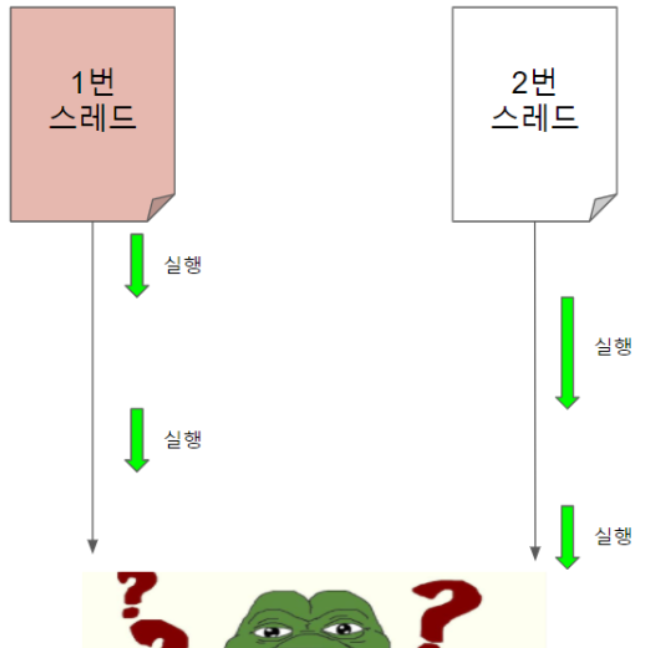

## Python

- **파이썬에서 multiprocess 를 생성하는 방법은?**

&nbsp;멀티프로세싱은 여러 개의 독립적인 프로세스를 생성하여 각 프로세스가 병렬로 작업하도록 하는 방식입니다. 각 프로세스는 독립적인 메모리 공간을 가지며, IPC 메커니즘을 통해 데이터를 교환할 수 있습니다.

파이썬에서 multiprocess를 생성하는 방법은 multiprocessing 모듈을 사용하는 것입니다. multiprocessing 모듈은 다중 프로세스를 사용하여 병렬 작업을 수행하는 데 도움이 되는 도구는 제공하며, GIL(Global Interpreter Lock)의 영향을 받지 않으므로 CPU 작업에 효과적입니다.

```python

import time


def heavy_work(name):
    result = 0
    for i in range(4000000):
        result += i
    print('%s done' % name)


if __name__ == '__main__':
    import multiprocessing

    start = time.time()
    procs = []
    for i in range(4):
        p = multiprocessing.Process(target=heavy_work, args=(i, ))
        p.start()
        procs.append(p)

    for p in procs:
        p.join()  # 프로세스가 모두 종료될 때까지 대기

    end = time.time()

    print("수행시간: %f 초" % (end - start))
```

※멀티스레딩 작업을 위한 threading이라는 모듈이 있는데 GIL에 영향을 받기 때문에 스레드는 GIL에 영향을 받지 않는 I/O 작업(네트워크 통신, 파일 읽기/쓰기) 등이 유리합니다.

출처: https://wikidocs.net/124290

https://mvje.tistory.com/207

- **파이썬 object 란 어떤 정보를 담고 있나요?**

&nbsp;파이썬 프로그램에서 모든 데이터는 객체(object)라는 개념을 사용하여 저장됩니다. 가장 기본이 되는 데이터 타입인 숫자, 문자여르 리스트, 사전은 다 객체입니다. 또한, 클래스를 사용한 사용자 정의 객체도 생성이 가능합니다. 각 객체는 신원(Identity), 타입(클래스), 값을 가집니다.

신원은 객체가 메모리에 저장된 위치를 가리킵니다(포인터).

객체의 타입은 내부적인 표현 형태(속성)와 객체가 지원하는 메서드 및 연산들을 설명합니다(클래스).

출처: https://happy-obok.tistory.com/22


- **GIL에 대해 설명해주세요. 🚨**

&nbsp;GIL(Global Interpreter Lock)은 여러 개의 스레드가 파이썬 바이트 코드를 실행하지 못하게 막는 일종의 뮤텍스(Mutex)입니다. 파이썬으로 작성된 프로세스는 한 시점에 하나의 스레드에만 모든 자원을 할당하고 다른 스레드는 접근할 수 없게 막아버리는데, 이 역할을 GIL이 수행합니다.


> 파이썬의 멀티 스레딩
> https://tibetsandfox.tistory.com/43

출처: https://tibetsandfox.tistory.com/43

https://bloofer.net/114

- **GIL이 없는 파이썬은 어떻게 동작하나요?**
- **List와 Tuple의 차이에 대해 설명해주세요.**
- **파이썬 코루틴에 대해 아는대로 설명해주세요.**
- **파이썬 데코레이터에 대해 아는대로 설명해주세요.**
- **MRO에 대해 설명해주세요.**
- **Magic Method에 대해 설명해주세요.**
- **new**와 **init**의 차이에 대해 설명해주세요.
- **repr**와 **str**의 차이에 대해 설명해주세요.
- **r string과 u string에 대해 설명해주세요.**
- **Call by Assignment에 대해 설명해주세요.**
- **파이썬에서의 접근제어 지시자에 대해 아는대로 설명해주세요.**
- **global과 nonlocal 키워드의 차이에 대해 설명해주세요.**
- **classmethod와 staticmethod의 차이에 대해 설명해주세요.**
- **파이썬의 GC 에 대해 설명해주세요.**
